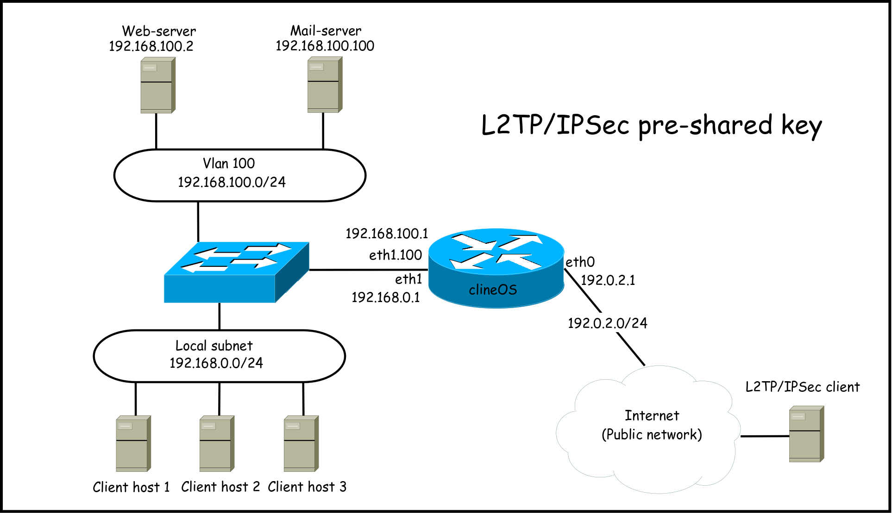

### Topology

### Configuration steps

1. Domain name
   * [Linux_Debian_7](linux_debian_7.md#domain-name)
   * [Linux_VyOS_1.1.0](linux_vyos_1.1.0.md#domain-name)
   * [FreeBSD_10.0_poptop](freebsd_10.0_poptop.md#domain-name)
2. DNS client settings
   * [Linux_Debian_7](linux_debian_7.md#dns-client-settings)
   * [Linux_VyOS_1.1.0](linux_vyos_1.1.0.md#dns-client-settings)
   * [FreeBSD_10.0_poptop](freebsd_10.0_poptop.md#dns-client-settings)
3. Network interfaces configuration.
   * [Linux_Debian_7](linux_debian_7.md#network-interfaces-configuration)
   * [Linux_VyOS_1.1.0](linux_vyos_1.1.0.md#network-interfaces-configuration)
   * [FreeBSD_10.0_poptop](freebsd_10.0_poptop.md#network-interfaces-configuration)
4. Default route rule
   * [Linux_Debian_7](linux_debian_7.md#default-route-rule)
   * [Linux_VyOS_1.1.0](linux_vyos_1.1.0.md#default-route-rule)
   * [FreeBSD_10.0_poptop](freebsd_10.0_poptop.md#default-route-rule)
5. Route rules
   * [Linux_Debian_7](linux_debian_7.md#route-rules)
   * [Linux_VyOS_1.1.0](linux_vyos_1.1.0.md#route-rules)
   * [FreeBSD_10.0_poptop](freebsd_10.0_poptop.md#route-rules)
6. L2TP/IPSEC configuration
   * [Linux_Debian_7](linux_debian_7.md#pptp-configuration)
   * [Linux_VyOS_1.1.0](linux_vyos_1.1.0.md#pptp-configuration)
   * [FreeBSD_10.0](freebsd_10.0.md#pptp-configuration)
7. NAT rules
   * [Linux_Debian_7](linux_debian_7.md#nat-rules)
   * [Linux_VyOS_1.1.0](linux_vyos_1.1.0.md#nat-rules)
   * [FreeBSD_10.0_poptop](freebsd_10.0_poptop.md#nat-rules)
8. NTP
   * [Linux_Debian_7](linux_debian_7.md#ntp)
   * [Linux_VyOS_1.1.0](linux_vyos_1.1.0.md#ntp)
   * [FreeBSD_10.0_poptop](freebsd_10.0_poptop.md#ntp)
9. DHCP server
   * [Linux_Debian_7](linux_debian_7.md#dhcp-server)
   * [Linux_VyOS_1.1.0](linux_vyos_1.1.0.md#dhcp-server)
   * [FreeBSD_10.0_poptop](freebsd_10.0_poptop.md#dhcp-server)
10. DNS forwarding
    * [Linux_Debian_7](linux_debian_7.md#dns-forwarding)
    * [Linux_VyOS_1.1.0](linux_vyos_1.1.0.md#dns-forwarding)
    * [FreeBSD_10.0_poptop](freebsd_10.0_poptop.md#dns-forwarding)
11. SSH server
    * [Linux_Debian_7](linux_debian_7.md#ssh-server)
    * [Linux_VyOS_1.1.0](linux_vyos_1.1.0.md#ssh-server)
    * [FreeBSD_10.0_poptop](freebsd_10.0_poptop.md#ssh-server)
12. Firewall ipv4
    * [Linux_Debian_7](linux_debian_7.md#firewall-ipv4)
    * [Linux_VyOS_1.1.0](linux_vyos_1.1.0.md#firewall-ipv4)
    * [FreeBSD_10.0_poptop](freebsd_10.0_poptop.md#firewall-ipv4)
14. Firewall ipv6
    * [Linux_Debian_7](linux_debian_7.md#firewall-ipv6)
    * [Linux_VyOS_1.1.0](linux_vyos_1.1.0.md#firewall-ipv6)
    * [FreeBSD_10.0_poptop](freebsd_10.0_poptop.md#firewall-ipv6)